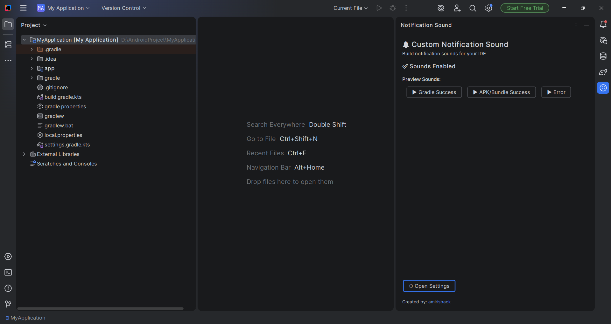
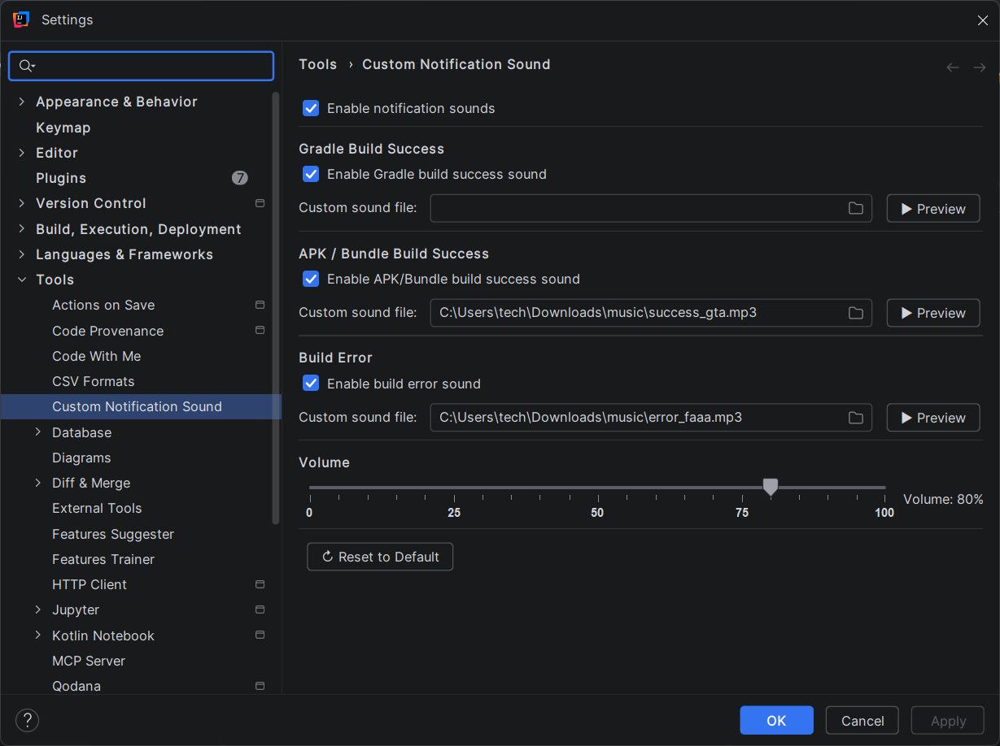

# Custom Notification Sound

Custom Notification Sound is an IntelliJ IDEA plugin that provides custom audio feedback for various build events or processes within the IDE.

## Key Features

- **Custom Sounds for Build Events:** Adds unique sounds for APK/Bundle build success, general Gradle build success, and build errors.
- **Flexible Configuration:** Users can define their own sound files (WAV and MP3 formats) according to their needs.
- **Volume Control:** Support for a dedicated volume adjuster for notification sounds.
- **Event Toggles:** Notification sounds can be enabled or disabled for each type of event.
- **Preview Panel:** Preview sounds directly from the configuration page (Settings panel) to test format and volume before saving settings.

## Screenshots

<div align="center">
  
  <br/>
  <i>Custom Notification Sound Settings Panel View</i>
  <br/><br/>
  
  <br/>
  <i>Custom sound file configuration, complete with preview button and volume setup</i>
</div>

---

## 🚀 How to Download

To download and use this plugin:
1. Go to the **Releases** page in this project's GitHub repository.
2. Download the latest release file which is usually a `.zip` file (e.g., `custom-notification-sound-1.0.0.zip`).
3. You can also search for this plugin directly in the **JetBrains Marketplace** (if the plugin has been officially published).

---

## 🛠️ Installation Guide (Install from Disk)

If you downloaded the package from *Releases* (as a `.zip` file), follow these manual installation steps:
1. Open IntelliJ IDEA (or other IntelliJ-based IDEs like Android Studio).
2. Navigate to **File** > **Settings** (or **IntelliJ IDEA** > **Preferences** on macOS) > **Plugins**.
3. Click the gear icon (⚙️) in the top right panel, then select **Install Plugin from Disk...**.
4. Browse and select the `.zip` file you just downloaded.
5. Click **Apply** or **OK**, then choose to *Restart IDE* if prompted.
6. After restarting, you can find the plugin configuration under **Settings > Tools > Custom Notification Sound**.

---

## 💻 Build from Source Code

If you want to modify or simply build this plugin yourself:

### Prerequisites:
- JDK 21 (according to the toolchain configured in `build.gradle.kts`)
- Gradle (the project already includes the Gradle Wrapper)

### Build Steps:
1. Open a terminal or command prompt, then clone this repository to your computer:
   ```bash
   git clone https://github.com/amirisback/custom-notification-sound.git
   ```
2. Change your working directory to the main project folder:
   ```bash
   cd custom-notification-sound
   ```
3. Run the Gradle task `buildPlugin` to package the plugin into a local distribution file:
   - **On Mac/Linux:**
     ```bash
     ./gradlew buildPlugin
     ```
   - **On Windows:**
     ```cmd
     gradlew.bat buildPlugin
     ```
4. After a successful build process, you can find the resulting `.zip` file inside the `build/distributions/` directory. You can then install it to your IDE by following the **Install from Disk** guide in the steps above.

## Plugin template structure

A generated project contains the following content structure:

```
.
├── .run/                   Predefined Run/Debug Configurations
├── build/                  Output build directory
├── gradle
│   ├── wrapper/            Gradle Wrapper
│   ├── libs.versions.toml  Version catalog
├── src                     Plugin sources
│   ├── main
│   │   ├── kotlin/         Kotlin production sources
│   │   └── resources/      Resources - plugin.xml, icons, messages
├── .gitignore              Git ignoring rules
├── build.gradle.kts        Gradle build configuration
├── gradle.properties       Gradle configuration properties
├── gradlew                 *nix Gradle Wrapper script
├── gradlew.bat             Windows Gradle Wrapper script
├── README.md               README
└── settings.gradle.kts     Gradle project settings
```

In addition to the configuration files, the most crucial part is the `src` directory, which contains our implementation
and the manifest for our plugin – [plugin.xml][file:plugin.xml].

> [!NOTE]
> To use Java in your plugin, create the `/src/main/java` directory.

## Plugin configuration file

The plugin configuration file is a [plugin.xml][file:plugin.xml] file located in the `src/main/resources/META-INF`
directory.
It provides general information about the plugin, its dependencies, extensions, and listeners.

You can read more about this file in the [Plugin Configuration File][docs:plugin.xml] section of our documentation.

If you're still not quite sure what this is all about, read our
introduction: [What is the IntelliJ Platform?][docs:intro]

$H$H Predefined Run/Debug configurations

Within the default project structure, there is a `.run` directory provided containing predefined *Run/Debug
configurations* that expose corresponding Gradle tasks:

| Configuration name | Description                                                                                                                                                                         |
|--------------------|-------------------------------------------------------------------------------------------------------------------------------------------------------------------------------------|
| Run Plugin         | Runs [`:runIde`][gh:intellij-platform-gradle-plugin-runIde] IntelliJ Platform Gradle Plugin task. Use the *Debug* icon for plugin debugging.                                        |
| Run Tests          | Runs [`:test`][gradle:lifecycle-tasks] Gradle task.                                                                                                                                 |
| Run Verifications  | Runs [`:verifyPlugin`][gh:intellij-platform-gradle-plugin-verifyPlugin] IntelliJ Platform Gradle Plugin task to check the plugin compatibility against the specified IntelliJ IDEs. |

> [!NOTE]
> You can find the logs from the running task in the `idea.log` tab.

## Publishing the plugin

> [!TIP]
> Make sure to follow all guidelines listed in [Publishing a Plugin][docs:publishing] to follow all recommended and
> required steps.

Releasing a plugin to [JetBrains Marketplace](https://plugins.jetbrains.com) is a straightforward operation that uses
the `publishPlugin` Gradle task provided by
the [intellij-platform-gradle-plugin][gh:intellij-platform-gradle-plugin-docs].

You can also upload the plugin to the [JetBrains Plugin Repository](https://plugins.jetbrains.com/plugin/upload)
manually via UI.

## Useful links

- [IntelliJ Platform SDK Plugin SDK][docs]
- [IntelliJ Platform Gradle Plugin Documentation][gh:intellij-platform-gradle-plugin-docs]
- [IntelliJ Platform Explorer][jb:ipe]
- [JetBrains Marketplace Quality Guidelines][jb:quality-guidelines]
- [IntelliJ Platform UI Guidelines][jb:ui-guidelines]
- [JetBrains Marketplace Paid Plugins][jb:paid-plugins]
- [IntelliJ SDK Code Samples][gh:code-samples]

[docs]: https://plugins.jetbrains.com/docs/intellij

[docs:intro]: https://plugins.jetbrains.com/docs/intellij/intellij-platform.html?from=IJPluginTemplate

[docs:plugin.xml]: https://plugins.jetbrains.com/docs/intellij/plugin-configuration-file.html?from=IJPluginTemplate

[docs:publishing]: https://plugins.jetbrains.com/docs/intellij/publishing-plugin.html?from=IJPluginTemplate

[file:plugin.xml]: ./src/main/resources/META-INF/plugin.xml

[gh:code-samples]: https://github.com/JetBrains/intellij-sdk-code-samples

[gh:intellij-platform-gradle-plugin]: https://github.com/JetBrains/intellij-platform-gradle-plugin

[gh:intellij-platform-gradle-plugin-docs]: https://plugins.jetbrains.com/docs/intellij/tools-intellij-platform-gradle-plugin.html

[gh:intellij-platform-gradle-plugin-runIde]: https://plugins.jetbrains.com/docs/intellij/tools-intellij-platform-gradle-plugin-tasks.html#runIde

[gh:intellij-platform-gradle-plugin-verifyPlugin]: https://plugins.jetbrains.com/docs/intellij/tools-intellij-platform-gradle-plugin-tasks.html#verifyPlugin

[gradle:lifecycle-tasks]: https://docs.gradle.org/current/userguide/java_plugin.html#lifecycle_tasks

[jb:github]: https://github.com/JetBrains/.github/blob/main/profile/README.md

[jb:forum]: https://platform.jetbrains.com/

[jb:quality-guidelines]: https://plugins.jetbrains.com/docs/marketplace/quality-guidelines.html

[jb:paid-plugins]: https://plugins.jetbrains.com/docs/marketplace/paid-plugins-marketplace.html

[jb:quality-guidelines]: https://plugins.jetbrains.com/docs/marketplace/quality-guidelines.html

[jb:ipe]: https://jb.gg/ipe

[jb:ui-guidelines]: https://jetbrains.github.io/ui

## Colaborator
Very open to anyone, I'll write your name under this, please contribute by sending an email to me

- Mail To faisalamircs@gmail.com
- Subject : Github _ [Github-Username-Account] _ [Language] _ [Repository-Name]
- Example : Github_amirisback_kotlin_admob-helper-implementation

Name Of Contribute
- Muhammad Faisal Amir
- Waiting List
- Waiting List

Waiting for your contribute

## Attention !!!
- Please enjoy and don't forget fork and give a star
- Don't Forget Follow My Github Account
